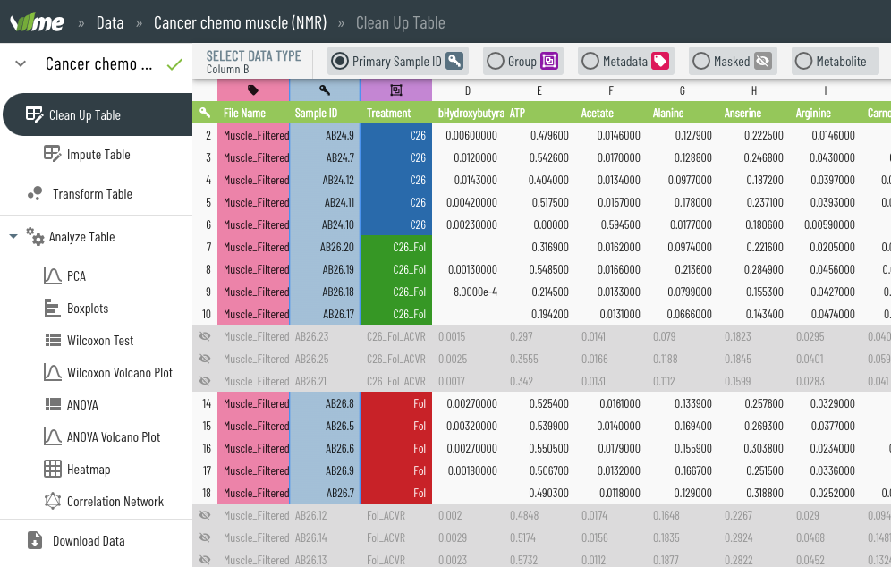
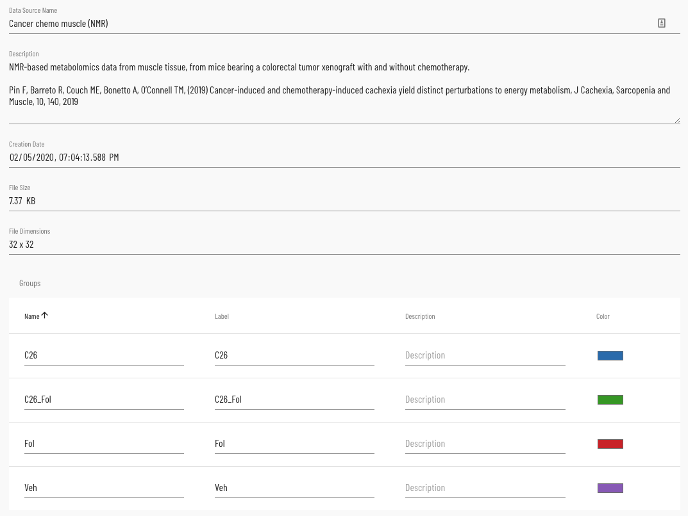
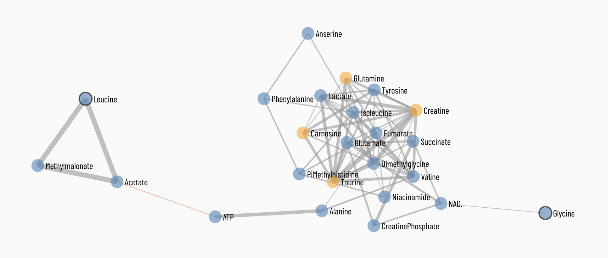
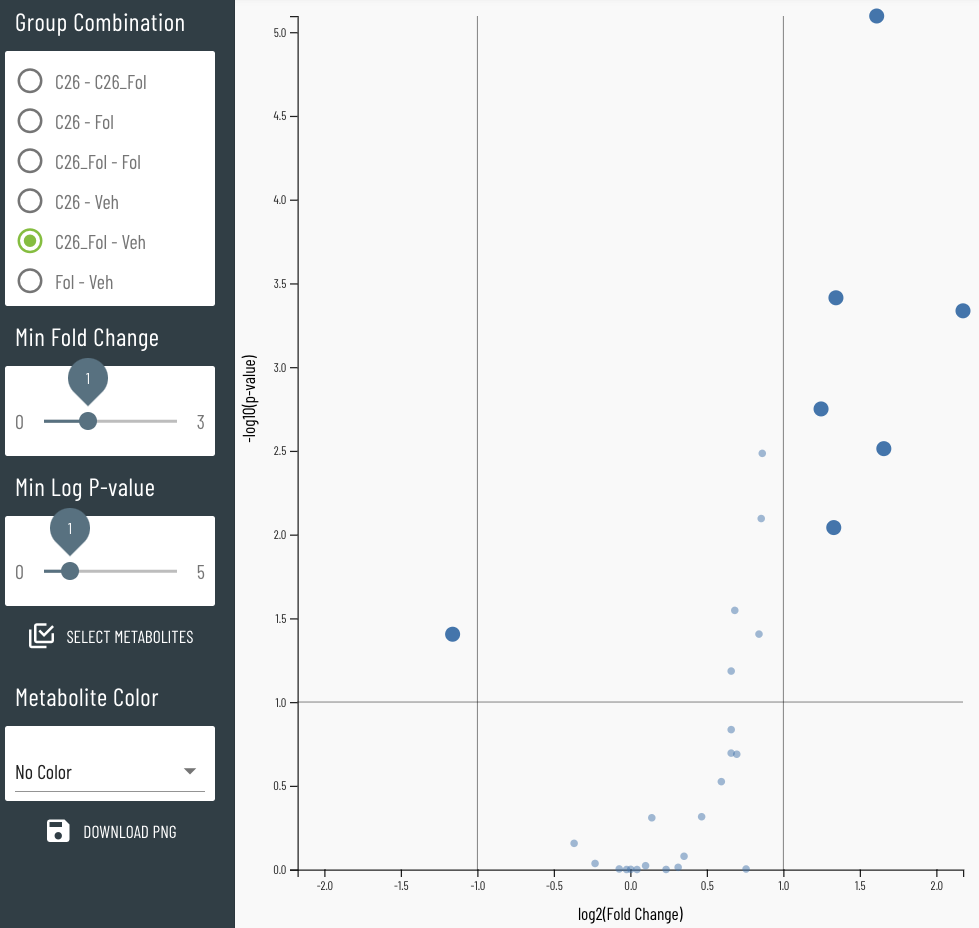

# Summary

Metabolomics involves the comprehensive measurement of metabolites from a
biological system. The resulting metabolite profiles are influenced by genetics,
lifestyle, diet and environment and therefore provides a more holistic
biological readout of the pathological condition of the organism [@beger:2016;
@wishart:2016]. The challenge for metabolomics is that no single analytical
platform can provide a truly comprehensive coverage of the metabolome. The most
commonly used platforms are based on mass-spectrometry (MS) and nuclear magnetic
resonance (NMR) methods. Investigators are increasingly using both methods to
increase the metabolite coverage. The challenge for this type of multi-platform
approach is that the data structure may be very different in these two
platforms. For example, NMR data may be reported as a list of spectral features
e.g. bins or peaks with arbitrary intensity units or more directly with named
metabolites reported in concentration units ranging from micromolar to
millimolar. Some MS approaches can also provide data in the form of identified
metabolite concentrations, but given the superior sensitivity of MS, the
concentrations can be several orders of magnitude lower than for NMR. Other MS
approaches yield data in the form of arbitrary response units where the dynamic
range can be more than 6 orders of magnitude. Given the diversity of data
structures (i.e. magnitude and dynamic range) integrating the data from multiple
platforms can be challenging.  This often leads investigators to analyze the
datasets separately which prevents the observation of potentially interesting
correlations between metabolites detected on different platforms.  Viime is an
open-source, web-based application designed to integrate metabolomics data from
multiple platforms. The workflow of Viime for data ingestion, pretreatment, data
fusion and visualization is shown in Figure 1.

TODO: create and insert Figure 1 (showing cleanup steps)

# User Interface Features and Architecture

## Data Pretreatment

Upload and pretreatment are the most critical and complicated steps of the
metabolomics workflow, and it is essential to make them easy and general so that
users are able to ingest and clean their data. The UI begins with presenting the
user with an upload screen, which shows whether any errors were encountered in
the file.

The user then is able to correct any errors, designate any column as the primary
ID, masked/hidden, a factor, the group, or a metabolite concentration column
(see Figure 1). The table view underwent significant refactoring of the client
and server to support tables that scale to hundreds of rows and thousands of
columns.
 

Any errors encountered during parsing are prompted for correction. Errors that
are detected include levels of missing data that exceed a default threshold
within a group or across all samples, non-numeric data in concentration data,
the lack of a primary ID, non-uniqueness of the primary ID. The UI guides the
user through each error and warning until the data is ready for analysis. In
this case, a low-variance metabolite is being flagged for possible omission from
analysis (see Figure 2).

Once errors are corrected, data imputation is automatically performed, and
options may be adjusted to specify the type of imputation, including random
forest, KNN, mean, or median imputation modes for completely at random
missingness (MCAR) and zero or half-minimum imputation for not-at-random
missingness (MNAR).

## Dataset Details

VIIME includes a dataset details page which includes size, creation time, and
enables the user to update the name and description for each dataset (see Figure
4). It is also a central location for assigning colors and descriptions to
groups, and keeping track of provenance for merged datasets.

A download page enables users to export their cleaned and processed dataset, or
download the currently selected metabolite list.

## Data Analysis

VIIME supports several downstream analyses. Wilcoxon and ANOVA perform p-value
computation, and enable threshold highlighting and metabolite selection by
p-value. Metabolite selections persist through all the interactive analysis
visualization in order to show the metabolites in many contexts.

A boxplot view gives a quick glance at the data ranges with the option to
separate and color by groups (see Figure 5).

VIIME also includes a fully interactive heatmap with row and column dendrograms
(see Figure 6). Selected metabolites are highlighted in orange on the left.
Sample groups are colored along the bottom to provide additional context.

Unique to VIIME is a metabolite correlation network diagram (see Figure 7). The
color in the diagram represents whether the metabolite was significantly
different across groups (orange) or not (blue). Metabolites are linked if the
correlation coefficient between them exceeds a configurable value. Negative
correlations are in red, while positive correlations are in gray. The width of
the link encodes the strength of the correlation.

Volcano plots (see Figure 8) were added to the software to highlight the
metabolites that meet a specified threshold for fold change and significance
(p-value). For datasets with only two groups the data from the Wilcoxon analysis
is plotted. Interactive threshold adjustments for both fold change and p-value
enable a simplified view. For datasets with more than two groups, the data from
an ANOVA analysis is used and has options to plot data from selected groups.
Options include selecting the group combination to analyze, the minimum fold
change to highlight, and the minimum p-value to highlight. The thresholds are
live controls which provide immediate feedback showing which metabolites meet
the criteria. Once the proper thresholds are set, the user may download the
resulting plot image, and also can save and download the metabolites that fall
into above the thresholds. When the significant metabolites are selected, the
user may move to any other plot to see those same metabolites highlighted in a
different context, such as the heatmap view or correlation network.

## Data Integration

VIIME supports multiple approaches for combining multiple data sources into a
joint analysis. From the data upload page, the user may initiate a dataset
merge, selecting the datasets to merge along with the algorithm to perform the
integration.

Supported algorithms are simple column concatenation, PCA data fusion, and
multi-block PCA fusion. After choosing an algorithm and two or more datasets,
the interface indicates how many of the samples will match after the merging
process. When the integration algorithm completes, the new integrated dataset
appears in the list of data for the user to perform analyses (see Figure 9).

# Backend Processing

VIIME’s processing backend is implemented as a RESTful API using the Flask web
framework. Data persistence is provided through normalized CSV files stored on a
filesystem and associated data in a SQLite database through SQLAlchemy’s ORM.
Files stored internally are linked with rows in the database using custom fields
provided by File Depot [@filedepot:web]. The backend leverages Pandas for raw
file parsing and normalization. Data processing is done by a combination of
Scikit-learn for common statistical algorithms and R packages for specialized
algorithms. The R-python integration is provided by a secondary REST service
exposed internally via OpenCPU.

Upon uploading a new dataset from an Excel or raw CSV file, the server begins by
constructing a Pandas dataframe. Any parsing errors due to malformed files
immediately result in an error response from the server. The Pandas object is
used to populate a new row in the primary data table with associated metadata
and processing defaults. Every row and column from the parsed dataset is also
added to related tables including header information, detected data type, and an
initial table structure determining properties such as which rows and columns
contain metadata, group information, or raw metabolite values.

The cleanup phase of the workflow allows users to override the initial table
structure for example by marking specific columns as metadata or by "masking"
rows so they are ignored in the processing steps. Each time the user makes a
change to the table structure the dataset is processed by a validation function
that determines whether the dataset is ready for processing. This validation
checks many properties of the dataset including that all metabolite values are
numeric and metabolite names are unique. In addition, the validation will warn
the user of likely problems such as too many missing or "not a number" values
within a metabolite or group or columns containing an excessively low variance.

Once validated, the original dataset is broken down into three tables, one
containing the raw metabolite measurements and two containing metadata about
each row and column in the measurement table. The measurement table is then
processed through imputation which fills in missing data using a series of
user-configurable algorithms. A function defines which metabolites have missing
data according to the Missing Not at Random (MNAR) or Missing Completely At
Random (MCAR) models, depending on the percentage of missing values per group
per metabolite. For each type of missingness the user can choose different
imputation methods; MNAR allows users to impute using the Zero or Half Minimum
strategies while MCAR allows imputation via Random Forest, K-Nearest Neighbor,
Mean, or Median. Most of the imputation methods were implemented in R, while
Random Forest and K-Nearest Neighbor were implemented with the R packages
`missForest` and `impute`, respectively.

Before statistical analysis is performed, the imputed dataset is passed through
a series of optional, user-configurable preprocessing steps including
normalization (Min Max, Sum, Reference Sample, Weight/Volume), transformation
(Log10, Log2, Square Root, Cube Root), and scaling (Autoscaling, Pareto Scaling,
Range Scaling, Vast Scaling, Level Scaling). All preprocessing functions were
programmed in R. After preprocessing, the dataset is ready for input into the
analysis methods.

# Future Work
